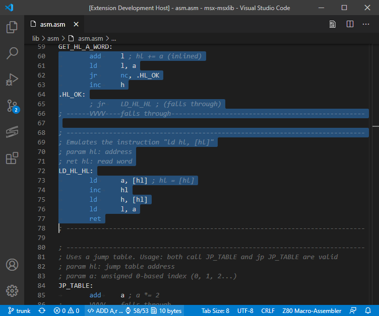

# Z80 Assembly meter in Visual Studio Code

The **Z80 Assembly meter** extension for Visual Studio Code meters clock cycles and bytecode size from Z80 assembly source code.

This extension meters timing in Z80 clock periods, referred to as T (time) cycles.

As the MSX standard requires so-called M1 wait cycles, this extension also meters M1 wait cycles for Z80 timing calculations on MSX. For a good explanation on how to do Z80 timing calculations on MSX, please read [Wait States](http://map.grauw.nl/resources/z80instr.php#waits) from Grauw [MSX Assembly Page](http://map.grauw.nl).

In Amstrad CPC architecture, all instruction timings are stretched so that they are all multiples of a microsecond (1\u00B5s), which is approximatively equivalent to the duration of a NOP instruction. This extension can meter duration in "number of NOPs" for timing calculations on Amstrad CPC.

## Features

Select Z80 assembly source code to view clock cycles and bytecode size in the status bar.

If there is no selection, the current line will be used.

## Recommendations

This extension can be installed standalone, but does not contribute any problem matcher, symbol provider, definition provider, or completion proproser for Z80 assembly.

Therefore, this extension can be installed alongside other Z80-related extensions such as:

* [Z80 Macro-Assembler](https://marketplace.visualstudio.com/items?itemName=mborik.z80-macroasm) by mborik
* [Z80 Assembly](https://marketplace.visualstudio.com/items?itemName=Imanolea.z80-asm) by Imanolea
* [MSX Z80](https://marketplace.visualstudio.com/items?itemName=sharksym.asm-msx) by Yeoungman Seo
* [pasmo](https://marketplace.visualstudio.com/items?itemName=boukichi.pasmo) by BouKiChi
* (and probably others)

## Extension Settings

This extension contributes the following settings:

* `z80-asm-meter.languageIds`: Additional language IDs for which the extension is enabled (such as "c", to meter in-lined assembly). Defaults to: `"z80-macroasm", "z80-asm", "z80", "pasmo"`.

* `z80-asm-meter.maxLines`: When working with huge files, metering can be disabled when the line count of the selection exceeds a certain threshold. Unlimited by default.

* `z80-asm-meter.maxLoC`: Stops metering when the parsed lines of code (LoC) count exceeds a certain threshold. Unlimited by default.

* `z80-asm-meter.timing`: Controls the visibility of the timing information in the status bar:
    * `disabled`: Timing information is not shown.
    * `z80` (default): Z80 timing information is shown.
    * `msx`: Z80 + M1 timing information is shown. Useful for Z80 timing calculations on MSX, as the MSX standard requires so-called M1 wait cycles.
    * `cpc`: Amstrad CPC timing information (in number of NOPs) is shown.
    * `z80+msx`: Both Z80 and MSX (Z80+M1) timing information are shown.
    * `z80+cpc`: Both Z80 and Amstrad CPC timing information are shown.

* `z80-asm-meter.size`: Controls the visibility of the size information in the status bar:
    * `disabled`: Size information is not shown.
    * `bytecode` (default): Bytecode size information is shown.
    * `loc`: Processed lines of code (LOC) count is shown.
    * `bytecode+loc`: Both bytecode size and LOC count are shown.

* `z80-asm-meter.opcode`: Controls the visibility of the instruction and its opcode in the status bar:
    * `disabled` (default): Neither instruction nor its opcode are shown.
    * `instruction`: The instruction is shown. Can be used to check if the extension is mistaking instructions.
    * `opcode`: The opcode of the instruction is shown.
    * `both`: Both instruction and its opcode are shown.

* `z80-asm-meter.maxOpcodes`: Stops instruction and opcode block visualization (in the tooltip) when the instruction count exceeds this value. Defaults to 16.

## Credits

Coded by [**theNestruo**](https://github.com/theNestruo) ([Néstor Sancho](https://twitter.com/NestorSancho)).
* Contributors: [**IIIvan37**](https://github.com/IIIvan37), [**hlide**](https://github.com/hlide)
* Inspired by Rafael Jannone [BiT](http://msx.jannone.org/bit/).
* [Z80 Instruction Set](http://map.grauw.nl/resources/z80instr.php) from Grauw [MSX Assembly Page](http://map.grauw.nl).
* Amstrad CPC timing information from [Rasm Z80 assembler](http://www.cpcwiki.eu/forum/programming/rasm-z80-assembler-in-beta/) documentation.

## Release Notes

### 0.5.0

- New option to disaply opcodes, by constributor: **hlide**
- Visibility configuration for instruction and its opcode

### 0.4.0

- Added `"z80"` (MSX Z80 by Yeoungman Seo) to the default additional language IDs
- Metering of the current line if there is no selection, by contributor: **hlide**

### 0.3.0

- Added configurable additional language IDs for which the extension is enabled

### 0.2.1

- Amstrad CPC timing explained in the readme file
- Added missing undocumented instructions: `OUT (C),0`, `SL1`/`SLL`
- Added alternative syntax: `JP HL`, `IN (C)`

### 0.2.0

- Amstrad CPC timing in NOPs added by contributor: **IIIvan37**
- Code refactor (for future improvements)

### 0.1.1

- Code clean-up
- CodeFactor integration
- Travis-CI integration

### 0.1.0

- Initial release
